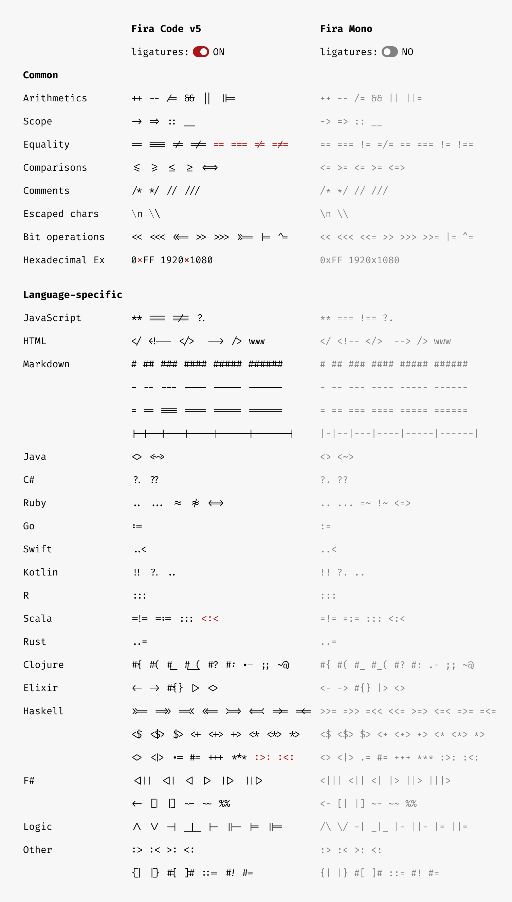

## 字体

[方正FW筑紫](https://www.foundertype.com/index.php/FontInfo/index/id/4981#)

https://www.foundertype.com/index.php/FontInfo/index/id/4981

适合开发人员使用的免费字体：JetBrains Mono

https://gitee.com/mirrors/JetBrainsMono

Cascadia Code：Cascadia Code字体源自Windows Terminal项目。该字体是用于编程的。具体来说，它有助于确定它包括编程连字。

https://github.com/microsoft/cascadia-code

Firacode：最好的整体编程字体

https://github.com/tonsky/FiraCode

源代码专业版：优雅且易读，由Adobe的一个才华横溢的团队创建

https://github.com/adobe/source-code-pro

Inconsolata：优雅，由杰出的设计师创造

https://www.levien.com/type/myfonts/inconsolata.html

Noto Mono：庞大的语言覆盖范围，由Google的大型团队创建

https://www.google.com/get/noto/#mono-mono